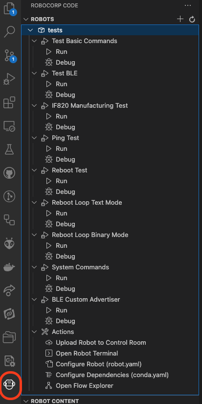

# Vela IF820 EZ-Serial Host

This repository contains samples and tests that demonstrate how a host can control the Vela IF820 module using the EZ-Serial API and serial protocol.

## Prerequisites

- A host with Python 3.x installed
- IF820 DVK(s)
- BT900 DVK(s) - Only for samples or tests involving the BT900

## Setup

### Python Samples

Before running any samples, be sure to install the Python dependencies:

```
pip3 install --user -r requirements.txt
```

All python samples require command line arguments to at least specify the serial port to use. For example:

```
python3 sample_ping.py -c COM3
```

### Robot Tests

It is recommended to use [Visual Studio Code (VS Code)](https://code.visualstudio.com/) for easy Robot Framework setup and for running the tests.

First install the following extensions for VS Code:

1. [Robocorp Code](https://marketplace.visualstudio.com/items?itemName=robocorp.robocorp-code)
2. [Robot Framework Language Server](https://marketplace.visualstudio.com/items?itemName=robocorp.robotframework-lsp)

Lastly, open the repository folder with VS Code or open the [workspace](if820_ezserial.code-workspace).

Once opened, VS Code will automatically setup Robot Framework and its dependencies. It can take a few minutes for this to complete.

## Running Tests

The first step before running the robot tests is to create a .vscode/settings.json file. To create the file copy and rename [.vscode/example_settings.json](.vscode/example_settings.json) to `.vscode/settings.json`.

The settings.json file is used to configure the COM ports and other settings used to communicate with the dev boards. This allows custom configuration without the need to change the robot test files.

If running tests that only require one IF820 device, set the COM port setting for the device1 (`comport_IF820_device1`). All tests that run and test a single IF820 device will use the device1 COM port setting.

The [tests/robot.yaml](tests/robot.yaml) file specifies all tests that can be run. Using the VS Code extension, you can run or debug the tests.

  
_Robot Tests_
